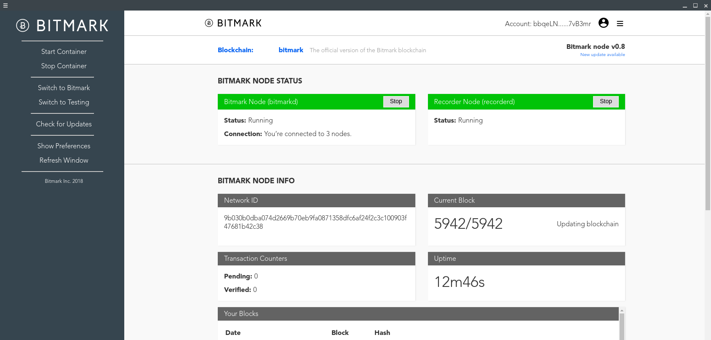

# Electron Application to control the Bitmark Node UI
### Download pre-compiled packages [here](https://github.com/zizzard/Electron-Bitmark-Node-Packages).
Built using Electron (v2.0.4) and Electron-Forge (v6.0.0-beta.22)

## Prerequisite
* Node.js 10.5.0 or newer
* npm 6.1.0 or newer
* [Electron Forge 6.0 or newer](https://github.com/electron-userland/electron-forge)

## Setup
Install npm depedencies:

```$ npm install ```

## Run
To start the application, use:

```$ electron-forge start```

## Build
To build the application, use:

```$ electron-forge build```

## Package
To package the application, use:

```$ electron-forge make```

<sub>_Currently creates a .deb and .rpm file_</sub>

## Application Screenshot

