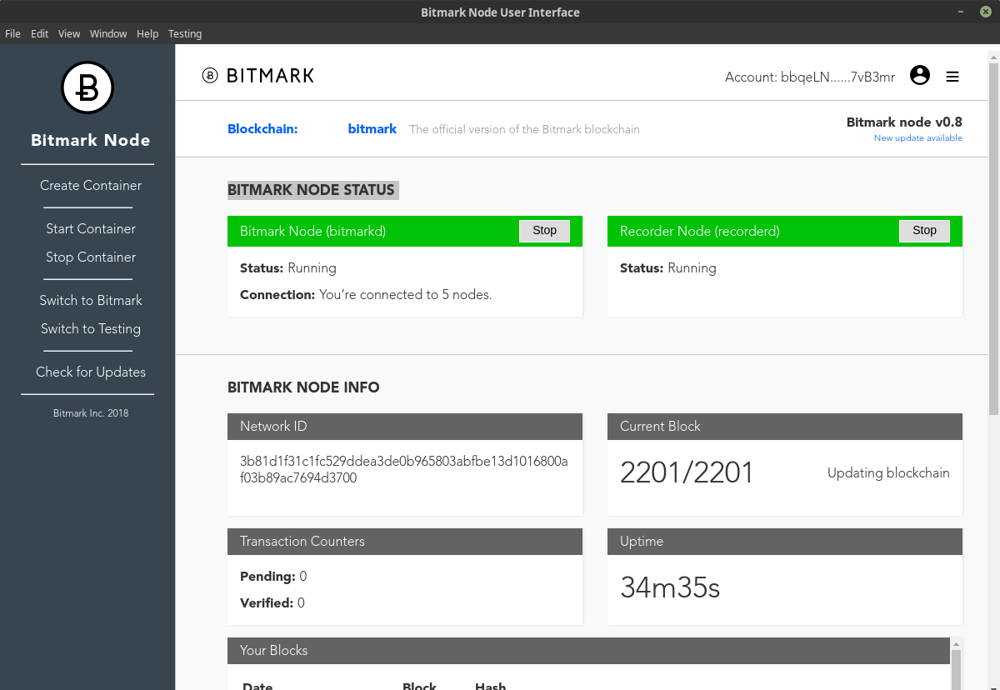

# Electron Application to control the Bitmark Node UI

Built using Electron (v2.0.3) and Electron-Forge (v6.0.0-beta.20)

## Prerequisite
* Node.js 10.3.0 or newer
* npm 6.1.0 or newer

## Setup
Install npm depedencies:
```$ npm install ```

## Run
To start the application, use:

```electron-forge start```

## Build
To build the application, use:
```electron-forge build```

## Application Screenshot
